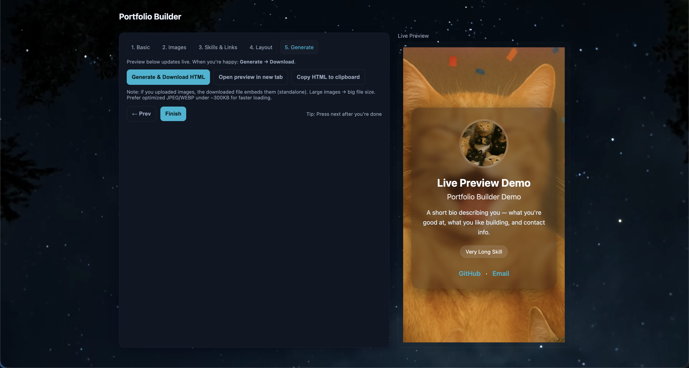

# Portfolio Builder

An easy to use, interactive website to create a standalone portfolio page in seconds — no coding required! Build, preview, and download your portfolio as a single HTML file that works anywhere.  

## Features

- **Live Preview:** See your portfolio update instantly as you type.  
- **Standalone HTML:** Generate a fully functional, standalone webpage with embedded images (base64, no external files required).  
- **Customizable Design:** Adjust theme colors, layout, and blur effects.  
- **Profile & Background Images:** Upload or link images for background and profile photo.  
- **Skills & Links:** Add skills with chips, and link GitHub, LinkedIn, website, or email.  
- **Responsive Layout:** Looks great on desktop and mobile.  
- **Easy Download & Sharing:** Generate your portfolio with a click and share it anywhere.  

  

---

## Usage

1. Open the [Portfolio Builder](https://fwextx.github.io/PortfolioBuilder) in your browser. 
2. Fill out your **Name**, **Headline**, **Bio**, and choose a **Theme Color**.
3. Upload a **Profile Picture** and **Background Image** or paste image URLs.
4. Add **Skills** by typing and pressing Enter.
5. Add links to your **GitHub, LinkedIn, Website** or **Email**.
6. Choose **Layout** and toggle extras like contact icons.  
7. When ready, click **Generate & Download HTML** to save your portfolio.

---

## License
This project is licensed under the GNU GPL v3. See the LICENSE file for details.

## Credits
- Images used for Portfolio Builder: [CrazyKitten3D](https://fwextx.itch.io/crazykitten3d)
- Portfolio Background Video: Mixkit
